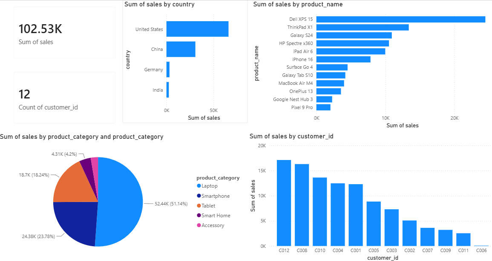

# Power BI Sales Dashboard

An interactive Power BI dashboard analyzing electronics retail sales — built to identify which products, markets, and customers are driving revenue.

## Business Question

A small electronics retailer wants to know where its $100K+ in revenue is actually coming from before planning next quarter's inventory and marketing spend: which product categories deserve more shelf space, which markets are underdeveloped relative to their customer base, and how dependent the business is on its biggest accounts.

## Dashboard Preview

## Key Insights

- **Laptops drive over half of all revenue.** $52,435 of $102,530 in total sales (51.1%) comes from the Laptop category alone — more than Smartphones and Tablets combined.
- **One product accounts for nearly a quarter of revenue.** The Dell XPS 15 generated $24,501 on its own (23.9% of total sales), making it the single highest-grossing SKU by a wide margin.
- **Revenue is geographically concentrated.** The US (64.4%) and China (30.0%) together account for over 94% of sales, while Germany (3.1%) and India (2.5%) are comparatively untapped despite having active customers.
- **The top 3 customers account for nearly half of revenue.** Chen Li, Wei Wang, and Emily Brown alone generated $47,068 of the $102,530 total (45.9%) across just 12 customers — a meaningful concentration risk if any one account churns.
- **Average order value is $1,025** across 100 orders, consistent with a catalog skewed toward higher-ticket items like laptops and smartphones rather than accessories.

## What This Suggests

Laptop's outsized share of revenue supports prioritizing it for inventory and promotional investment, but the customer concentration is worth flagging to leadership — a retention-focused strategy for the top 3 accounts, paired with active account growth in Germany and India, would reduce reliance on the current US/China-heavy customer base.

## Dataset

| File | Description | Key Columns |
|---|---|---|
| `Orders.csv` | 100 order-level transactions | `order_id`, `order_date`, `customer_id`, `product_name`, `product_category`, `quantity`, `sales` |
| `Customers.csv` | 12 customer profiles | `customer_id`, `first_name`, `last_name`, `country`, `state`, `city`, `score` |

This is a synthetic dataset built for portfolio purposes — order and customer records are not real transactions. The two tables are related on `customer_id` in the Power BI data model.

## Dashboard Visuals

- KPI cards: total sales, customer count
- Sales by country (bar)
- Sales by product (horizontal bar)
- Sales by product category (pie)
- Sales by customer (bar)

## Tools & Skills

Power BI Desktop, Power Query (data import & shaping), data modeling (table relationships), data visualization design, business storytelling.

## How to Use

**Open the finished dashboard:**
1. Clone this repository
2. Open `sales_dashboard.pbix` in Power BI Desktop

**Or rebuild it from source:**
1. Open Power BI Desktop → Get Data → CSV
2. Load `Orders.csv` and `Customers.csv`
3. Create a relationship between the two tables on `customer_id`
4. Build visuals as described above

## Author

**Bhumit Vasava**
MSc Mathematics & Computing — IIT Bhilai
[LinkedIn](https://linkedin.com/in/bhumit-vasava-420102301) | [GitHub](https://github.com/BhumitJ7)
